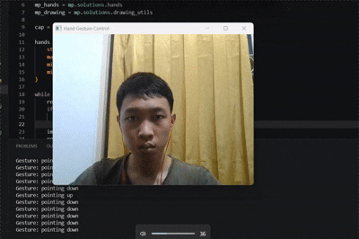

# Hand Gesture Recognition using MediaPipe and OpenCV

A Computer Vision project that leverages **MediaPipe** and **OpenCV (cv2)** for real-time hand tracking and gesture recognition. This repository showcases how hand landmarks can be used to create intuitive and touchless interactions with a computer through a webcam.

## Project Overview

This repository contains two independent applications:

### 1. Hand Gesture Volume Controller
A touchless volume control system that allows users to increase or decrease the computer's audio volume using hand movements.

### 2. Hand Gesture Classification
A real-time gesture recognition system that identifies predefined hand gestures such as Thumbs Up, Thumbs Down, numbers 1–4, and High Five.

Both applications utilize MediaPipe's hand landmark detection and OpenCV's image processing capabilities to perform real-time recognition and interaction.

---

## Technologies Used

- Python
- OpenCV (cv2)
- MediaPipe
- NumPy
- Scikit-learn (Gesture Classification)
- Pycaw (Volume Controller)

---

# Project 1: Hand Gesture Volume Controller

## Description

This application enables users to control the system volume without touching any physical device. By measuring the distance between the thumb and index finger, the system dynamically adjusts the audio volume level.

## Features

- Real-time hand tracking
- Touchless volume control
- Dynamic volume adjustment
- Live visual feedback
- Webcam-based interaction

## How It Works

1. OpenCV captures video frames from the webcam.
2. MediaPipe detects hand landmarks.
3. The distance between the thumb and index finger is calculated.
4. The distance is mapped to the system volume range.
5. The computer volume is adjusted accordingly.

## Example Controls

| Gesture | Action |
|----------|----------|
| Fingers closer together | Decrease Volume |
| Fingers farther apart | Increase Volume |

---

# Project 2: Hand Gesture Classification

## Description

This application recognizes and classifies predefined hand gestures in real time. The detected gesture label is displayed directly on the screen.

## Supported Gestures

| Gesture | Meaning |
|----------|----------|
| 👍 | Thumbs Up |
| 👎 | Thumbs Down |
| ☝️ | One |
| ✌️ | Two |
| 3 Fingers | Three |
| 4 Fingers | Four |
| ✋ | High Five |

## Features

- Real-time gesture recognition
- Multiple gesture classes
- Fast and lightweight inference
- Live prediction display
- Easy to extend with custom gestures

## How It Works

1. OpenCV captures video frames.
2. MediaPipe extracts 21 hand landmarks.
3. Landmark coordinates are used as input features.
4. The classification model predicts the gesture class.
5. The predicted label is displayed on the screen.

